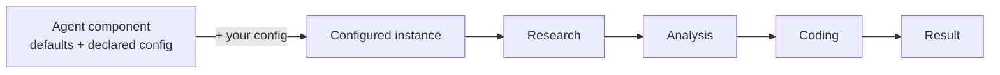

# AgentCompose

> **Compose autonomous agents as reusable, configurable components.** AgentCompose
> is an open contract and runtime for orchestrating independently-built agents —
> run each as-is or tune its knobs, then assemble them into larger workflows
> instead of rebuilding everything inside one monolithic app.

---

## Why

Today's AI agents are powerful but **isolated** — each ships its own interfaces,
configuration, execution model, and orchestration logic. They're hard to reuse,
reconfigure, compose, or integrate into larger autonomous workflows.

**AgentCompose** treats agents as reusable components — like container images or
Terraform modules. Each agent ships with **defaults** and exposes a set of
**typed, declared knobs** (model/provider, system prompt, tools, resources,
limits). You run it as-is or configure it for your context; the agent's internals
stay private, while its **configuration and interaction surfaces** are
standardized.

## Principles

- **Configurable reuse** — declare typed config + defaults; run as-is or override, no forking.
- **Goals, not instructions** — each agent decides *how* to solve its task.
- **Internals private, surfaces public** — opaque execution; standardized config + interaction.
- **Composable** — assemble workflows from specialized, configured instances.
- **Implementation-agnostic** — any language, model, or framework.

## How it relates to MCP & A2A

| Standard | Focus |
|----------|-------|
| **MCP** | An agent's access to tools & resources |
| **A2A** | Agent-to-agent communication |
| **AgentCompose** | **Configuration, orchestration & the lifecycle** of reusable agent components |

## Repositories

| Repo | Description |
|------|-------------|
| [**spec**](https://github.com/agentcompose/spec) | The contract: JSON Schemas + normative specification |
| [**sdk-typescript**](https://github.com/agentcompose/sdk-typescript) | TypeScript SDK — define configurable agent components (`npm i @agentcompose/sdk`) |
| [**engine**](https://github.com/agentcompose/engine) | Headless orchestration engine — goal → plan → execute (`npm i @agentcompose/engine`) |
| [**research-agent**](https://github.com/agentcompose/research-agent) | Reference worker (`research`) — adaptive, cited deep-research report |
| [**analysis-agent**](https://github.com/agentcompose/analysis-agent) | Reference worker (`analyze`) — weighted-criteria ranking + recommendation |
| [**coding-agent**](https://github.com/agentcompose/coding-agent) | Reference worker (`code`) — edits a scoped, diffable workspace |
| [**playground**](https://github.com/agentcompose/playground) | A React harness over the engine — a live value test |
| _sdk-python_ | _(planned)_ Python SDK |
| _registry_ | _(planned)_ Discovery catalog for agents |

## Status

🚀 Published on npm with build provenance:
[`@agentcompose/spec@0.1.1`](https://www.npmjs.com/package/@agentcompose/spec),
[`@agentcompose/sdk@0.1.2`](https://www.npmjs.com/package/@agentcompose/sdk), and
[`@agentcompose/engine@0.1.2`](https://www.npmjs.com/package/@agentcompose/engine) —
plus three reference worker agents (`research`, `analyze`, `code`) that demonstrate
real cross-domain coordination through the engine, with end-to-end tracing. Early
and evolving (`0.x`): the contract shape is intended to be durable, but additive and
breaking changes may still occur before `1.0`. Feedback and RFC-style proposals welcome.

## License

[Apache-2.0](https://github.com/agentcompose/spec/blob/main/LICENSE)
