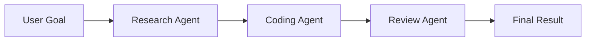

# AgentCompose

> **Compose autonomous agents into larger systems.** AgentCompose is an open
> contract and runtime for orchestrating independently-built agents as reusable
> components — instead of rebuilding everything inside one monolithic app.

---

## Why

Today's AI agents are powerful but **isolated** — each ships its own interfaces,
execution model, and orchestration logic. They're hard to reuse, compose, or
integrate into larger autonomous workflows.

**AgentCompose** treats agents as reusable components. Each agent owns its
internals (models, prompts, memory, tools, planning). AgentCompose owns only the
**contract** through which they interact — so any agent, in any language, local or
remote, OSS or proprietary, can participate in a workflow.

## Principles

- **Agents receive goals, not instructions** — each decides *how* to solve its task.
- **Agents own execution; AgentCompose owns coordination.**
- **Composable** — assemble workflows from specialized agents.
- **Implementation-agnostic** — any language, model, or framework.

## How it relates to MCP & A2A

AgentCompose **complements** existing standards:

| Standard | Focus |
|----------|-------|
| **MCP** | Access to tools & resources |
| **A2A** | Agent-to-agent communication |
| **AgentCompose** | Orchestration, composition & the task lifecycle |

## Repositories

| Repo | Description |
|------|-------------|
| [**spec**](https://github.com/agentcompose/spec) | The contract: JSON Schemas + normative specification |
| _sdk-typescript_ | _(coming soon)_ TypeScript SDK |
| _sdk-python_ | _(coming soon)_ Python SDK |
| _runtime_ | _(coming soon)_ The orchestration runtime |
| _registry_ | _(coming soon)_ Discovery catalog for agents |

## Status

🚧 Early and evolving (`0.x`). The contract shape is intended to be durable;
breaking changes may still occur before `1.0`. Feedback and RFC-style proposals
welcome.

## License

[Apache-2.0](https://github.com/agentcompose/spec/blob/main/LICENSE)
